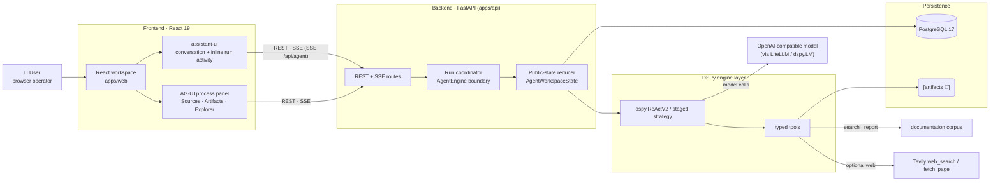
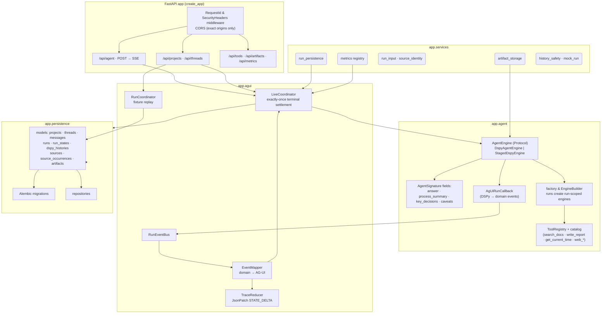
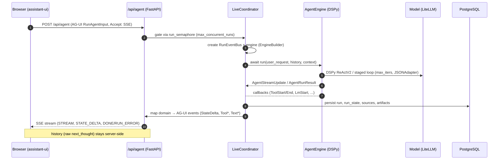
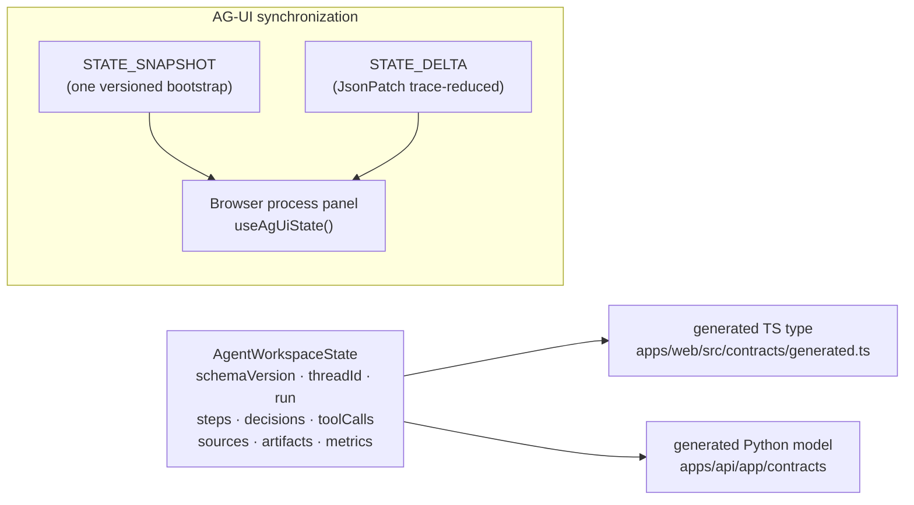
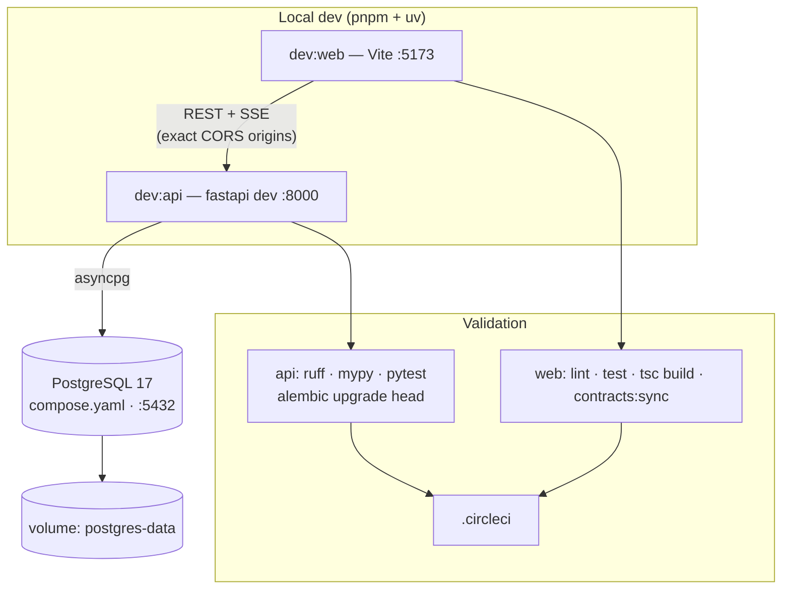

# Fleet Agent — Architecture

An experimental agent workbench built around **DSPy 3.3.1**. Multi-step agent
work that is useful, inspectable, and recoverable — a direct answer plus a
persistent, browser-visible agent workspace.

Render the diagrams below in any Mermaid-capable viewer (GitHub, GitLab,
Obsidian, mermaid.live). An interactive, themed version is also available in
[`docs/architecture.html`](architecture.html) (open in a browser).

- **Frontend**: React 19 + Vite, assistant-ui 0.15 + AG-UI process panel.
- **Backend**: FastAPI, DSPy ReActV2 / staged strategy, Pinia-free AG-UI SSE.
- **Data**: PostgreSQL 17 (`compose.yaml`), Alembic migrations, local artifacts.

---

## 1 · System Context

---

## 2 · Component Diagram

---

## 3 · Agent Run Flow (engine mode)

**Fixtures mode** replays deterministic, provider-free AG-UI streams
(`packages/contracts/fixtures`); **engine mode** uses the live DSPy bridge.

---

## 4 · Public State Contract

Source of truth: `packages/contracts/agent-workspace-state.schema.json` (v1).
Payloads carry `schemaVersion`; generated TS and Python models come from the
schema, never handwritten.

**Exposed (safe):** run status, active step, tool activity, sources, decisions,
caveats, metrics, sanitized artifacts.
**Never crosses:** raw `next_thought`, `dspy.History`, provider prompts, raw
tool arguments, stack traces, unsanitized responses, credentials.

---

## 5 · Runtime & Persistence

---

### Key invariants

- **URL owns state** — active project & thread: `/projects/:id/threads/:id`.
- **No mirrored agent state** — process panel reads AG-UI state directly.
- **One versioned bootstrap** — thread restoration fetches one versioned
  snapshot; fallback uses raw `fetchBootstrap`.
- **Scoped DSPy** — `dspy.context(...)` only, never global `dspy.configure`.
- **Alembic migrations** for persistence; engine runs require an existing thread.
- **Contract workflow**: edit schema → `contracts:sync` (TS) → regenerate Python
  model → run freshness tests.
